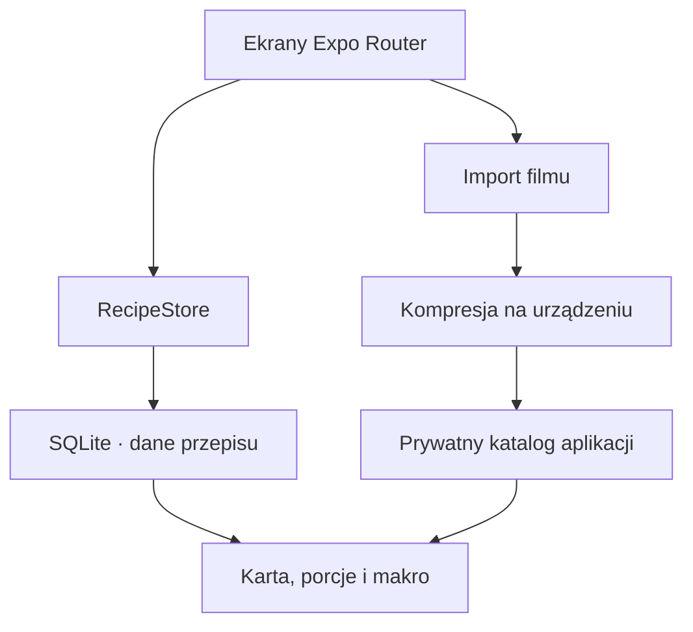

# CookClip

CookClip to prywatna, lokalna książka przepisów z filmami na iOS i Androida. Dodajesz link źródłowy oraz film, kompresujesz go bezpośrednio na telefonie, a później masz całe danie w jednej czytelnej karcie: składniki, kroki, porcje, makro i wideo.

> Status: działający MVP `0.1.0`. Dane i filmy nie opuszczają urządzenia. Automatyczne rozpoznawanie składników z mowy/obrazu jest kolejnym etapem — obecna wersja daje pełny lokalny edytor i nie udaje, że wysyła film do „magicznego AI”.

## Co już działa

- dwie platformy z jednego kodu: iOS i Android;
- automatyczny motyw jasny/ciemny;
- kafelkowe menu dań, wyszukiwarka, kategorie i ulubione;
- obowiązkowy film przy tworzeniu własnego przepisu;
- link źródłowy z rozpoznaniem TikToka, Instagrama i YouTube;
- bezpośredni odczyt publicznego tytułu/opisu i lokalne podpowiedzi składników oraz kroków;
- lokalna kompresja filmu i miniatury bez backendu;
- profile `540p / 600 kb/s`, `720p / 1 Mb/s` i `1080p / 2,2 Mb/s`;
- pełny edytor nazwy, kategorii, porcji, czasów, składników, kroków i notatek;
- kalorie, białko, węglowodany, tłuszcz, błonnik, cukry i sól;
- wartości odżywcze dla jednej porcji oraz całego przepisu;
- automatyczne skalowanie ilości składników po zmianie liczby porcji;
- timestamp przy każdym kroku — dotknięcie kroku przewija film do właściwego momentu;
- menedżer pamięci z ponowną kompresją już zapisanych filmów;
- SQLite i pliki aplikacji jako jedyne miejsce zapisu;
- przykładowe karty danych przy pierwszym uruchomieniu, żeby od razu zobaczyć układ aplikacji.

## Prywatność i import linków

CookClip nie ma kont, chmury ani własnego API. Baza SQLite, miniatury i skompresowane filmy są przechowywane w prywatnym katalogu aplikacji na telefonie. Po usunięciu przepisu aplikacja usuwa również zarządzane przez nią pliki multimedialne.

W wersji `0.1.0` CookClip łączy się bezpośrednio z podanym źródłem, odczytuje publiczny tytuł/opis i prostymi regułami tworzy lokalne podpowiedzi składników oraz kroków. Nie ma pośredniego serwera. Film wybierasz z galerii, bo TikTok, Instagram i YouTube nie gwarantują aplikacjom dostępu do surowego pliku dowolnego filmu. Automatyczne pobieranie bez oficjalnej zgody mogłoby łamać zasady platform lub prawa autora. Użytkownik powinien dodawać wyłącznie materiały, do których ma prawo.

Kolejny etap doda udostępnianie linku prosto z aplikacji społecznościowej oraz lokalny model analizujący również mowę i klatki filmu. Gdy źródło nie udostępni danych, nadal pozostanie bezpieczny wybór pliku z galerii i pełny edytor.

## Jak to jest zbudowane



Najważniejsze katalogi:

```text
src/app/          ekrany i routing
src/components/   kafelki, odtwarzacz, panele UI
src/services/     SQLite, pliki i kompresja
src/store/        lokalny stan przepisów
src/types/        model danych
src/utils/        makro, porcje i formatowanie
```

## Uruchomienie

Wymagane są Node.js 24+, Xcode na macOS dla iOS albo Android Studio dla Androida.

```bash
npm ci
npx expo prebuild
npx expo run:ios
# albo
npx expo run:android
```

Do zwykłego podglądu interfejsu można użyć `npm start`, ale właściwa kompresja z `react-native-compressor` wymaga development builda, nie samego Expo Go.

## Jakość

```bash
npm run check
npx expo-doctor
```

`npm run check` uruchamia lint, ścisłe sprawdzanie TypeScriptu i testy obliczeń porcji, wartości odżywczych oraz formatowania. Ten sam zestaw działa automatycznie w GitHub Actions.

## Następne etapy

1. Share Extension / Android Share Target do wysyłania linku prosto z aplikacji społecznościowej.
2. Lokalna transkrypcja filmu i analiza klatek.
3. Lokalny model tworzący szkic przepisu bez wysyłania treści na serwer.
4. Eksport/import zaszyfrowanej kopii zapasowej wybranej przez użytkownika.
5. Testy urządzeniowe i dystrybucja TestFlight / Google Play Internal Testing.

## Licencja

[MIT](LICENSE)
